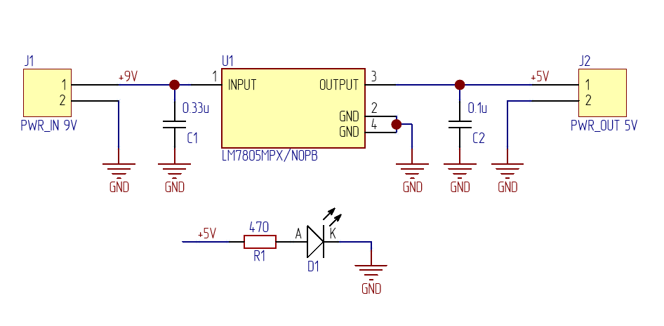
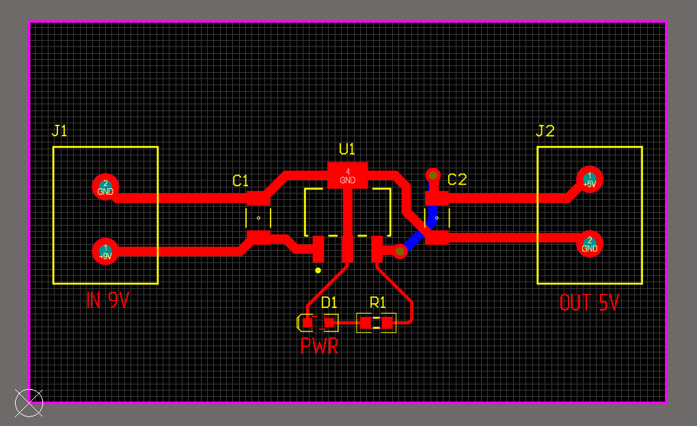
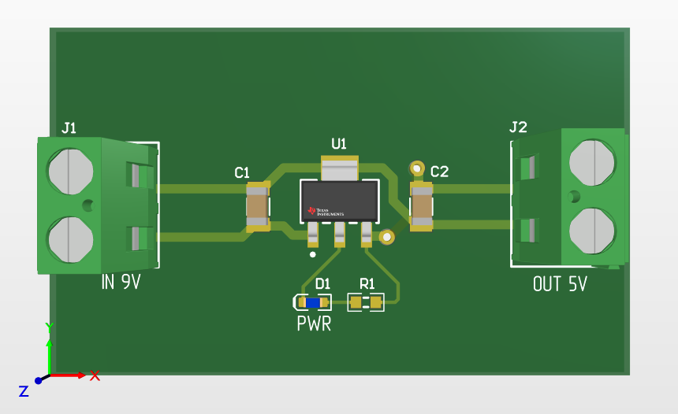

# 01 — LM7805 Power Supply

Simple 5V / 1A linear voltage regulator board.

## Description

Fixed 5V output from 7–35V input using LM7805 linear regulator.
LED power indicator on output. First learning project.

**Specifications:**
- Input voltage: 7–35V DC
- Output voltage: 5V DC (fixed)
- Max output current: 1A
- LED indicator current: ~6 mA
- PCB size: 50 × 30 mm, 2 layers

**Key components:**
- U1: LM7805MPX — 5V linear regulator (SOT-223)
- C1: 0.33 µF — input bypass capacitor
- C2: 0.1 µF — output bypass capacitor
- R1: 470 Ohm — LED current limiting resistor
- D1: LED — power indicator
- J1: 2-pin connector — power input 9V
- J2: 2-pin connector — power output 5V

## Schematic

**LED current calculation:**
I = (5V - 2V) / 470R = ~6 mA

## PCB

**PCB manufactured at:** JLCPCB / PCBWay (files ready)

## Files

| File | Description |
|---|---|
| `altium/` | Altium Designer project files |
| `gerber/gerber-lm7805.zip` | Production-ready Gerber files |
| `bom/bom-lm7805.csv and bom/bom-lm7805.xlsx` | Bill of Materials |

## Status

- [x] Schematic — LED circuit
- [x] Schematic — LM7805 with bypass caps
- [x] PCB layout — components placed
- [x] PCB routing — all nets connected
- [x] DRC passed — no violations
- [x] Gerber files generated
- [x] BOM exported