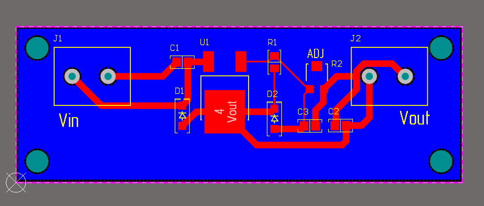
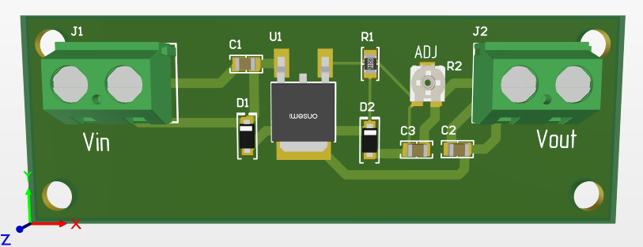

# 02 — LM317 Adjustable Power Supply

Adjustable 1.25–15V / 1.5A linear power supply.

## Description

Regulated output voltage using LM317 in D2PAK package
with potentiometer adjustment.
Protection diodes per datasheet recommendation (Note E).

**Specifications:**
- Input voltage: 9–24V DC
- Output voltage: 1.25–15V DC (adjustable)
- Max output current: 1.5A
- Adjustment: 2.2k potentiometer
- PCB size: 60 × 40 mm, 2 layers

**Output voltage formula:**
Vout = 1.25 × (1 + R2/R1), where R1 = 240 Ohm

**Voltage examples:**
| R2 (Ohm) | Vout (V) |
|---|---|
| 0 | 1.25 |
| 240 | 2.5 |
| 680 | 4.8 |
| 2200 | 12.6 |

**Key components:**
- U1: LM317 (D2PAK) — adjustable regulator
- C1: 0.1 µF — input bypass (per datasheet Note A)
- C2: 1 µF — output capacitor (per datasheet Note B)
- C3: 10 µF 25V X5R 0805 — output filter (GRM21BR61E106MA73L)
- R1: 240 Ohm — set resistor
- R2: 2.2k potentiometer — voltage adjustment
- D1: 1N4007 — input protection (per datasheet Note E)
- D2: 1N4007 — output protection (per datasheet Note E)

## Schematic

## PCB

## New skills vs Project 01

- Custom schematic symbol (LM317)
- Custom PCB footprint (TO-220-3)
- Mixed mounting: SMD + through-hole
- Protection diodes per datasheet
- Potentiometer for adjustment
- 2-layer board with GND polygon

## Files

| File | Description |
|---|---|
| `altium/` | Altium Designer project files |
| `altium/MyComponents.SchLib` | Custom schematic library |
| `altium/MyComponents.PcbLib` | Custom PCB footprint library |
| `gerber/gerber-lm317.zip` | Production-ready Gerber files |
| `bom/bom-lm317.csv` | Bill of Materials |

## Status

- [x] Custom LM317 schematic symbol
- [x] Custom TO-220 PCB footprint
- [x] Schematic complete, ERC passed
- [x] PCB routing complete, DRC passed
- [x] GND polygon on Bottom Layer
- [x] Gerber files generated
- [x] BOM exported