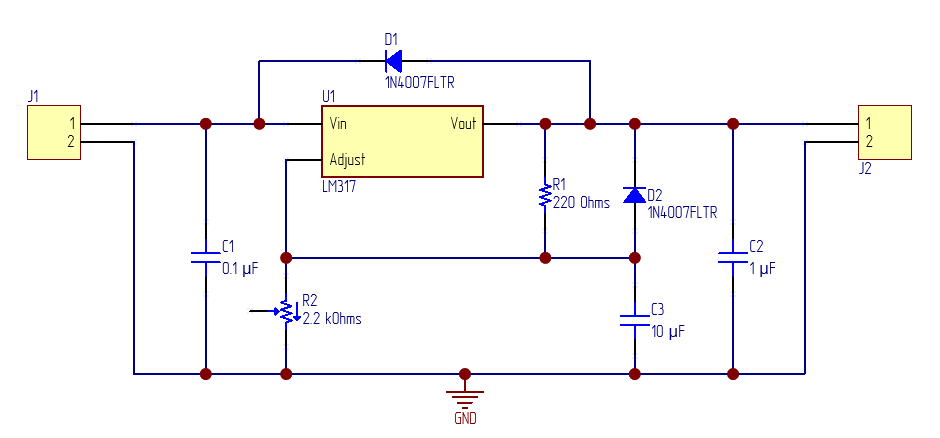

# 02 — LM317 Adjustable Power Supply

Adjustable 1.25–15V / 1.5A linear power supply.

## Description

Regulated output voltage using LM317 with potentiometer.
Protection diodes per datasheet recommendation.

**Specifications:**
- Input voltage: 9–24V DC
- Output voltage: 1.25–15V DC (adjustable)
- Max output current: 1.5A
- Adjustment: 2.2k potentiometer

**Formula:**
Vout = 1.25 × (1 + R2/R1), where R1 = 220 Ohm

## Schematic

## Status

- [x] Custom LM317 schematic symbol (Day 9)
- [x] Custom TO-220 footprint (Day 9)
- [x] Schematic complete (Day 9)
- [ ] PCB layout
- [ ] Gerber files
- [ ] BOM